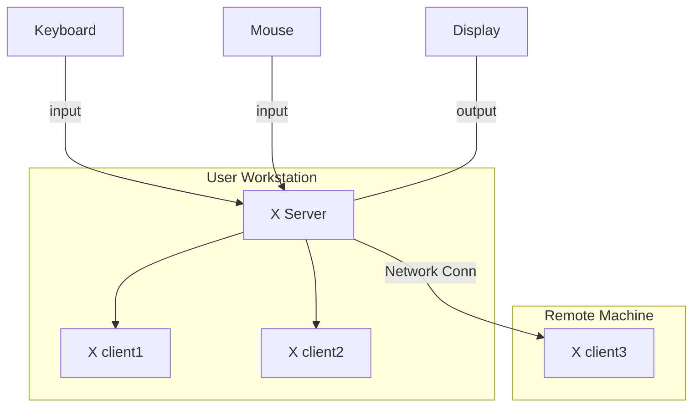

# minilibx kickstarter

## Table o'Contents
<!-- mtoc-start -->

* [X-Window System](#x-window-system)
* [X client-server Architecture](#x-client-server-architecture)
* [Implementation](#implementation)
  * [mlx_init()](#mlx_init)
  * [t_xvar struct](#t_xvar-struct)
  * [mlx_new_window()](#mlx_new_window)
  * [t_win_list struct](#t_win_list-struct)
* [Events](#events)
  * [X11 Keysyms](#x11-keysyms)
* [Hooks](#hooks)
  * [mlx_hook()](#mlx_hook)
* [Footnotes](#footnotes)

<!-- mtoc-end -->
___

**minilibX** is a small library, a simplified version of XLib written in C , designed to introduce students to the **X-Window System**. [^1]

## X-Window System

The **X-Window System** is an architecture independent windowing system for bitmap displays that provides a basic framework for creating graphical user interfaces. [^2]

It enables users to draw and move windows on a display using the mouse and keyboard.

> [!Note]
>
> In computing, a `bitmap` (also known as `bit array` or `bitmap index`) is a mapping from a given domain (for instance, a range of integers) to bits. [^3]

## X client-server Architecture

X is based on a client-server model: 

> one **X server** connects to multiple **X client** programs.


The X Server receives requests to output graphics on the display (through windows) and sends back user input (from a keyboard, mouse, etc).

> [!Note]
>
> There are many implementations of the X Window System (Xlib), minilibx being just one among many following the X Consortium standard; [^4]
> - [Xlib : X Consortium Standard](https://www.x.org/releases/current/doc/libX11/libX11/libX11.html)
___

## Implementation

### mlx_init()

The `mlx_init()` function initializes and returns a pointer to the address of a `t_xvar` structure. This struct is malloced with memory from the heap. 
```c
void	*mlx_init()
{
	t_xvar	*xvar;
	
	if (!(xvar = malloc(sizeof(*xvar))))
		return ((void*)0);
	if ((xvar->display = XOpenDisplay("")) == 0)
	{
		free(xvar);
		return ((void*)0);
	}
	xvar->screen = DefaultScreen(xvar->display);
	xvar->root = DefaultRootWindow(xvar->display);
	xvar->cmap = DefaultColormap(xvar->display,xvar->screen);
	xvar->depth = DefaultDepth(xvar->display,xvar->screen);
	if (mlx_int_get_visual(xvar)==-1)
	{
		printf(ERR_NO_TRUECOLOR);
		exit(1);
	}
	xvar->win_list = 0;
	xvar->loop_hook = 0;
	xvar->loop_param = (void *)0;
	xvar->do_flush = 1;
	xvar->wm_delete_window = XInternAtom (xvar->display, "WM_DELETE_WINDOW", False);
	xvar->wm_protocols = XInternAtom (xvar->display, "WM_PROTOCOLS", False);
	mlx_int_deal_shm(xvar);
	if (xvar->private_cmap)
		xvar->cmap = XCreateColormap(xvar->display,xvar->root,
				 xvar->visual,AllocNone);
	mlx_int_rgb_conversion(xvar);
	xvar->end_loop = 0;
	return (xvar);
}
```

### t_xvar struct

The `t_var` struct contains all the information about the window and the display `minilibx` will need to do its job.

```c
typedef struct	s_xvar 
{
	Display		*display;
	Window		root;
	int			screen;
	int			depth;
	Visual		*visual;
	Colormap	cmap;
	int			private_cmap;
	t_win_list	*win_list;
	int			(*loop_hook)();
	void		*loop_param;
	int			use_xshm;
	int			pshm_format;
	int			do_flush;
	int			decrgb[6];
	Atom		wm_delete_window;
	Atom		wm_protocols;
	int 		end_loop;
}				t_xvar;
```
___

### mlx_new_window()

The `mlx_new_window()` function returns a pointer to the address of a new `t_win_list` struct.
```c
void	*mlx_new_window(t_xvar *xvar,int size_x,int size_y,char *title)
{
	t_win_list				*new_win;
	XSetWindowAttributes	xswa;
	XGCValues				xgcv;

	xswa.background_pixel = 0;
	xswa.border_pixel = -1;
	xswa.colormap = xvar->cmap;
	/*
	xswa.event_mask = ButtonPressMask | ButtonReleaseMask | ExposureMask |
		KeyPressMask | KeyReleaseMask | StructureNotifyMask;
	*/
	/* xswa.event_mask = ExposureMask; */
	xswa.event_mask = 0xFFFFFF;	/* all events */
	if (!(new_win = malloc(sizeof(*new_win))))
		return ((void *)0);
	new_win->window = XCreateWindow(xvar->display,xvar->root,0,0,size_x,size_y,
					0,CopyFromParent,InputOutput,xvar->visual,
					CWEventMask|CWBackPixel|CWBorderPixel|
					CWColormap,&xswa);
	mlx_int_anti_resize_win(xvar,new_win->window,size_x,size_y);
	XStoreName(xvar->display,new_win->window,title);
	XSetWMProtocols(xvar->display, new_win->window, &(xvar->wm_delete_window), 1);
	xgcv.foreground = -1;
	xgcv.function = GXcopy;
	xgcv.plane_mask = AllPlanes;
	new_win->gc = XCreateGC(xvar->display,new_win->window,
				GCFunction|GCPlaneMask|GCForeground,&xgcv);
	new_win->next = xvar->win_list;
	xvar->win_list = new_win;
	/*
	new_win->mouse_hook = mlx_int_do_nothing;
	new_win->key_hook = mlx_int_do_nothing;
	new_win->expose_hook = mlx_int_do_nothing;
	*/
	bzero(&(new_win->hooks), sizeof(new_win->hooks));
	XMapRaised(xvar->display,new_win->window);
	mlx_int_wait_first_expose(xvar,new_win->window);
	return (new_win);
}
```
___

### t_win_list struct

The `t_win_list` struct contains all the information about the window and the display.
```c
typedef struct	s_win_list
{
	Window				window;
	GC					gc;
	struct s_win_list	*next;
	int					(*mouse_hook)();
	int					(*key_hook)();
	int					(*expose_hook)();
	void				*mouse_param;
	void				*key_param;
	void				*expose_param;
	t_event_list		hooks[MLX_MAX_EVENT];
}				t_win_list;
```
___

## Events

### X11 Keysyms

`X11` `keysyms` are portable representations of the symbols on the caps of keys. They are used to process keyboard events in a consistent manner across different systems and hardware configurations.

`Keysyms` are defined in two standard include files: `<X11/keysym.h>` and `<X11/keysymdef.h>`. These files contain several families of `keysyms` such as `LATIN1`, `LATIN2`, `LATIN3`, `LATIN4`, `KATAKANA`, `ARABIC`, `CYRILLIC`, `GREEK`, `TECHNICAL`, `SPECIAL`, `PUBLISHING`, `APL`, `HEBREW`, and `MISCELLANY`.

Each `keysym` is a four-byte value. In the standard `keysyms`, the least significant 8 bits indicate a particular `character` within a set, and the next 8 bits indicate a particular `keysym set`. **The order of the sets is important** since not all the sets are complete. Some `keysyms` do not have obvious counterparts on the keyboard, but may be generated with certain key combinations [^5]

> [!Important]
>
> **Keysym VS Keycode**
>
> `keycodes` and `keysyms` in `X11` are both used to identify keys on a keyboard, but they serve different purposes and are used in different ways.
>
> **TLDR**: A keycode identifies a key, while a keysym identifies the symbol produced by pressing a key.
>
> - A `keycode` is a hardware-specific `character` code. it is determined by the X server implementation and the physical keyboard layout. Because of this, generally an X app cannot use `keycodes` directly because the assignment of `keycodes` to keys can vary between different systems and keyboard configurations. However, `keycodes` provide a way to handle keyboard input at a low level
>
> - A `keysym` is a portable representation of the keyboard inputs. It provides a consistent way to process keyboard events across different systems and hardware configurations. `Keysyms` are defined in terms of the symbols they represent, such as 'space', 'escape', 'x', '2', etc. Unlike `keycodes`, `keysyms` are not tied to the physical location of keys on the keyboard.
>

## Hooks

### mlx_hook()

The `mlx_hook()` function is a hook registration function.

The input event is filtered by an event mask (`x_mask` filtering by type) and by event name (`x_event`), then the appropriate hook (handler function) is registered.

```c
int	mlx_hook(t_win_list *win, int x_event, int x_mask, 
		 int (*funct)(),void *param)
{
  win->hooks[x_event].hook = funct;
  win->hooks[x_event].param = param;
  win->hooks[x_event].mask = x_mask;
}

```
> [!Note]
>
> `minilibx` has some convenient alias of `mlx_hook()` to hook to specific events:
> - `mlx_expose_hook()` for expose events
> - `mlx_key_hook()` for key up events
> - `mlx_mouse_hook()` for mouse down events

___

# Footnotes

[^1]: [minilibx-linux repo : 42Paris](https://github.com/42Paris/minilibx-linux)
[^2]: [X-Window System : Wikipedia](https://en.wikipedia.org/wiki/X-Window_System)
[^3]: [Bitmap : Wikipedia](https://en.wikipedia.org/wiki/Bitmap)
[^4]: [Xlib : Wikipedia](https://en.wikipedia.org/wiki/Xlib)
[^5]: [Xlib Keysyms : Oreilly.com](https://www.oreilly.com/library/view/xlib-reference-manual/9780937175262/16_appendix-h.html)
