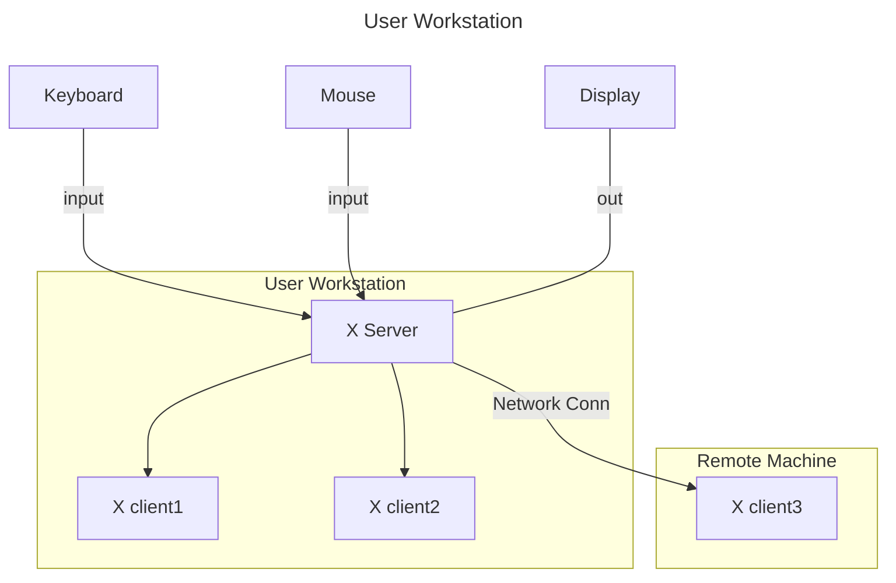

# minilibx kickstarter

**minilibX** is a simple X-Window API written in C, designed to introduce students to the **X-Window System**. [^1]

## X-Window System

The **X-Window System** is an architecture independent windowing system for bitmap displays that provides a basic framework for creating graphical user interfaces. [^2]

It enables users to draw and move windows on a display using the mouse and keyboard.

> [!Note]
>
> In computing, a `bitmap` (also known as `bit array` or `bitmap index`) is a mapping from a given domain (for instance, a range of integers) to bits. [^3]

## X client-server Architecture

X is based on a client-server model: 

> one **X server** connects to multiple **X client** programs.

The X Server receives requests to output graphics on the display (through windows) and sends back user input (from a keyboard, mouse, etc).

___

# Footnotes

[^1]: [minilibx-linux repo : 42Paris](https://github.com/42Paris/minilibx-linux)
[^2]: [X-Window System : Wikipedia](https://en.wikipedia.org/wiki/X-Window_System)
[^3]: [Bitmap : Wikipedia](https://en.wikipedia.org/wiki/Bitmap)
